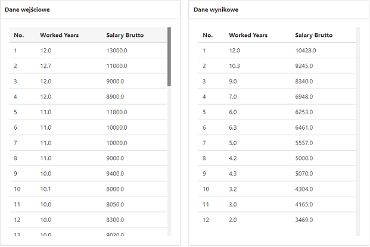
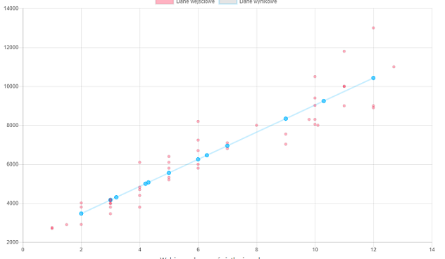

Opis funkcjonalności aplikacji
==============================

Aplikacja wykonuje obliczenia brakujących wartości oraz prezentuje
wyniki na stronie WWW przy użyciu frameworka Django.

Wymagane moduły
===============

Wymagane biblioteki zawarte są w pliku
'projects/static/requirements.txt'

-  matplotlib==3.0.2
-  numpy==1.15.4
-  pandas==0.23.4
-  Django==2.1.5
-  django-chartjs==1.3

Instalacja modułów: ``pip install -r requirements.txt``

Opis działania aplikacji Django
-------------------------------

Aplikacja służy do wizualizacji danych wejściowych oraz wyjściowych
obliczonych za pomocą modułu 'linear\_regression'

Funkcjonalności
~~~~~~~~~~~~~~~

1. Definicja źródła danych jako bazy sqlite
^^^^^^^^^^^^^^^^^^^^^^^^^^^^^^^^^^^^^^^^^^^

Domyślną bazą danych jest baza sqlite

.. code:: python

    DATABASES = {
        'default': {
            'ENGINE': 'django.db.backends.sqlite3',
            'NAME': os.path.join(BASE_DIR, 'db.sqlite3'),
        }
    }

2. Import danych z pliku CSV do bazy sqlite
^^^^^^^^^^^^^^^^^^^^^^^^^^^^^^^^^^^^^^^^^^^

Aplikacja po naciśnięciu odpowiedniego przycisku, który wyświetli się jeżeli w tabeli nie ma żadnego rekordu,
dokona importu danych z pliku 'salary.csv'.

3. Prezentacja danych na stronie WWW za pomocą frameworka Django
^^^^^^^^^^^^^^^^^^^^^^^^^^^^^^^^^^^^^^^^^^^^^^^^^^^^^^^^^^^^^^^^

Dane prezentowane są w formie dynamicznie wyświetlanej tabeli utworzonej
przy wykorzystaniu instrukcji ``<table>, <tr>, <td>`` itd.

   tabela.png

4. Obliczanie brakujących wartości na podstawie otrzymanych danych za pomocą modułu linear\_regression
^^^^^^^^^^^^^^^^^^^^^^^^^^^^^^^^^^^^^^^^^^^^^^^^^^^^^^^^^^^^^^^^^^^^^^^^^^^^^^^^^^^^^^^^^^^^^^^^^^^^^^

Wartości obliczane są za pomocą modułu linear\_regression po kliknięciu
przycisku "Oblicz" lub resetowane do domyślnych wartości przyciskiem
"Resetuj".

5. Prezentacja danych w formie wykresu z wykorzystaniem biblioteki django-jchart
^^^^^^^^^^^^^^^^^^^^^^^^^^^^^^^^^^^^^^^^^^^^^^^^^^^^^^^^^^^^^^^^^^^^^^^^^^^^^^^^

W sekcji "Wykres" znajduje się wykres danych treniungowych oraz
wynikowych. Utworzony został za pomocą biblioteki Chart.js, która
pozwala na proste i szybkie umieszczanie wykresów na stronie.
Zamieszczony pod wykresem formularz ``POST`` umożliwia zmianę zakresu
wyświetlania wykresu.

   wykres.png

Modele
~~~~~~

Aplikacja zawiera jeden model, który opisuje pojedynczy wiersz danych.

.. code:: python

    class Data(models.Model):
        workedYears = models.FloatField()
        salaryBrutto = models.FloatField(null=True)
        test = models.IntegerField(null=True, default=0)

Widoki
~~~~~~

index
^^^^^

W tym widoku generowane jest menu

ProjectView
^^^^^^^^^^^

Ten widok oparty jest o klasę. Zawarte są w nim metody ``get``, która
odpowiada za przekazanie danych do przeglądarki, oraz ``post``,
odpowiadająca za przekazanie danych z formularza do serwera. Jest także
metoda ``get_data``, która zamienia dane pobrane z bazy danych do
formatu JSON - który umożliwia wyświetlenie wykresu za pomocą biblioteki
``chartjs``.

Opis działania modułu linear\_regression
----------------------------------------

Moduł linear\_regression zawiera klasę i metody służące do przewidywania
brakujących wartości na podstawie danych wejściowych za pomocą regresji
liniowej. Moduł znajduje się w folderze ``projects/modules``.

Klasa: linear\_regression.LinearRegression
~~~~~~~~~~~~~~~~~~~~~~~~~~~~~~~~~~~~~~~~~~

+--------------------------------+------------------------------------------------+
| Metoda                         | Opis                                           |
+================================+================================================+
| fit(X,y)                       | oblicza współczynniki regresji                 |
+--------------------------------+------------------------------------------------+
| calculate\_error(y, y\_pred)   | oblicza współczynnik determinacji              |
+--------------------------------+------------------------------------------------+
| predict(X)                     | przewiduje brakujące wartości i zwraca listę   |
+--------------------------------+------------------------------------------------+

``fit(X, y)``
^^^^^^^^^^^^^

-  oblicza współczynniki regresji

   ::

       paramerty: X - lista, treningowy zbiór danych 
                  y - lista, wynikowy zbiór danych

``calculate_error(y, y_pred)``
^^^^^^^^^^^^^^^^^^^^^^^^^^^^^^

-  oblicza współczynnik determinacji

   ::

       parametry: y - rzeczywista wartość zmiennej Y 
                  y - wartość teoretyczna (przewidywana) zmiennej
       zwraca:    współczynnik determinacji

``predict(X)``
^^^^^^^^^^^^^^

-  przewiduje brakujące wartości i zwraca listę

   ::

       parametry: y - zmienne niezależne (features)
       zwraca:    lista 

Przykład
^^^^^^^^

.. code:: python

    >>> from linear_regression import LinearRegression
    >>> reg = LinearRegression()
    >>> x = np.array([1, 2, 3, 4])
    >>> y = np.array([10, 12, 14, 16])
    >>> reg.fit(x, y)
    >>> reg.coef
    [2.0, 8.0]
    >>> reg.predict([5])
    [18]

Metoda: linear\_regression.plot\_regression\_line
~~~~~~~~~~~~~~~~~~~~~~~~~~~~~~~~~~~~~~~~~~~~~~~~~

Wyrysowuje linię regresji na wykresie za pomocą modułu matplotlib.pyplot

::

    parametry: x - zmienne niezależne 
               y - zmienne zależne
               coef - lista współczynników regresji
               Opcjonalne parametry:
               x_label - opis osi x
               y_label - opis osi y
               title - tytuł wykresu

